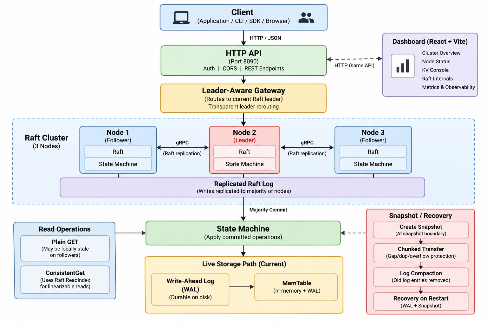

<div align="center">

# ⚡ ForgeDB

**A distributed key-value database engine built from scratch in Go, using Raft consensus to replicate writes across a cluster and survive node failures.**

<p>
  
  
  
  
  
  
</p>
<p>
  
  
</p>

### 🗺️ System Architecture



</div>

A normal key-value store saves data on one machine. ForgeDB explores what happens once that machine is no longer allowed to be the single source of truth — writes have to survive a crashed leader, a restarted node, and a retried request, without losing or duplicating anything.

---

## What is ForgeDB?

- **Multiple nodes** (3 by default), each holding a full copy of the data.
- **One leader at a time** — only the leader accepts writes.
- Every write is **replicated** to followers and only counts as **committed** once a **majority** has it.
- Committed writes are applied to a **state machine** and persisted locally, so they survive a restart.
- If the leader crashes, the cluster **elects a new one** and keeps accepting writes — clients don't notice.
- The old leader **recovers** from disk and catches back up automatically.

That's Raft, in six bullets. Everything below is how ForgeDB actually implements it — and which parts are tested against a real cluster versus implemented but not yet load-bearing.

## Why is this interesting?

Not just "HTTP API + map + database." Each of these is individually easy to fake — ForgeDB's test suite (chaos scenarios, a linearizability checker, real 3-node Docker failover) is built to make faking them hard.

| Capability | Why it matters |
|---|---|
| 🧠 **Raft consensus** | Prevents two nodes from independently accepting conflicting writes |
| 🛡️ **Majority commit** | A write isn't durable until a quorum has it, not just one node |
| 🔄 **Request deduplication** | Retries after a timeout/leader change can't double-apply a write |
| 📡 **Leader-aware gateway** | Clients never need to track which node is currently leader |
| 📸 **Snapshots + chunked transfer** | Log compaction and recovery without one unbounded RPC payload |
| 🧪 **Chaos + linearizability testing** | Failures are injected and checked against a reference model, not assumed |

## What makes it different?

| Typical single-node CRUD project | ForgeDB |
|---|---|
| Single process, one source of state | Multi-node cluster, replicated Raft log |
| Writes go straight to disk | Writes pass through consensus first |
| No leader election | Raft leader election + term safety |
| Restart loses in-memory state | WAL + snapshot recovery |
| Failure rarely tested | Real `docker stop` leader-failure testing |
| Client must know the backend address | Leader-aware gateway abstracts it away |

## Verified capabilities

✅ = verified against a real 3-node Docker cluster in this release. ⚙️ = implemented and unit/integration tested, not yet exercised live.

| | |
|---|---|
| ✅ Leader election, majority commit | ✅ Leader failure → re-election → gateway reroute |
| ✅ Old-leader rejoin + commit-index catch-up | ✅ Bearer-token auth (401/200 paths) |
| ✅ Prometheus `/metrics` under real traffic | ✅ Graceful shutdown (SIGTERM) |
| ✅ Snapshot creation (manual trigger) | ⚙️ WAL crash recovery |
| ⚙️ Chunked snapshot transfer (corruption/gap/dup/overflow) | ⚙️ Request deduplication across restarts |
| ⚙️ Linearizability checker | ⚙️ Chaos testing (crashes, partitions) |

## What happens when the leader dies?

```text
Node 1 (leader) fails  →  Raft election  →  Node 2 or 3 becomes leader
     →  Gateway follows the new leader, writes continue
     →  Node 1 restarts, rejoins as a follower, catches up
```

Tested with a real `docker stop` on the live leader — not a simulation. Pre- and post-failover writes stayed intact throughout.

## Storage engine

**Live write path:** `Raft commit → State Machine → MemStore → WAL (fsync) → MemTable`. Durability comes from the WAL plus Raft's own replicated log.

The repo also contains independently tested **SSTable**, **Manifest**, and **Compaction** packages — implemented, but **not wired into the live write path**. This is a deliberate scope boundary, not an oversight (see [Future Work](#future-work)).

## API

| Method | Path | Auth | Notes |
|---|---|---|---|
| GET | `/health`, `/ready` | none | Liveness / readiness |
| GET | `/metrics` | Bearer | Prometheus text |
| GET | `/cluster` | Bearer | Role, term, indices |
| GET / PUT / DELETE | `/kv/{key}` | Bearer | 421 + leader hint if not leader |
| POST | `/admin/snapshot` | Bearer | Manual snapshot trigger |

Auth: `Authorization: Bearer <token>`. CORS: exact-origin allow-list via `FORGEDB_CORS_ORIGINS`, disabled by default.

## Dashboard

React + TypeScript UI for cluster topology, KV console, Raft internals, and metrics. Local dev (`npm run dev`) proxies the bearer token server-side for genuinely live data. **A deployed build (e.g. Vercel) has no server-side proxy, so live authenticated data is a local-dev-only capability today** — see [Limitations](#limitations).

## Run it yourself

```bash
git clone https://github.com/Kushall-07/forgedb.git
cd forgedb
cp .env.example .env          # set FORGEDB_API_TOKEN — never commit a real token

docker compose build
docker compose up -d
docker compose ps

curl http://127.0.0.1:8090/health                                   # via gateway
curl -X PUT http://127.0.0.1:8090/kv/foo -H "Authorization: Bearer <token>" -d "bar"
curl http://127.0.0.1:8090/kv/foo -H "Authorization: Bearer <token>"
```

Full walkthrough: [`docs/deployment/forgedb-1.0-demo-runbook.md`](docs/deployment/forgedb-1.0-demo-runbook.md) (health, auth, KV lifecycle, leader failure/recovery, snapshots, shutdown).

## Testing

```bash
go test ./...     # 25 packages, 19 with tests, all pass
go vet ./...
go build ./...
```

`-race` requires CGO/gcc, unavailable on this Windows dev environment — not a known ForgeDB data race. Notable suites: `internal/raft` (44+ tests incl. snapshot transfer), `internal/dbnode` (restart/recovery), `chaos/` (fault injection), `correctness/` (linearizability checker).

<details>
<summary><strong>Project structure</strong></summary>

```text
internal/raft                                    Raft consensus
internal/dbnode                                  Node composition (Raft + storage + state machine)
internal/statemachine                            Deduplicating KV state machine
internal/storage                                 WAL-backed MemStore (live path)
internal/storage/sstable, manifest, compaction   LSM components (not on live path)
internal/transport                               gRPC transport
internal/api                                     HTTP API, auth, CORS
internal/gateway                                 Leader-aware reverse proxy
chaos/, correctness/                             Fault injection, linearizability checker
dashboard/                                        React/TypeScript operator dashboard
deploy/, docs/                                   Deployment scripts, design writeups
```

</details>

## Limitations

- SSTable/Manifest/Compaction exist but aren't on the live write path.
- Cluster membership is static — no add/remove-node without a restart.
- Inter-node gRPC is plaintext; one shared bearer token, no scopes/rotation.
- Deployed (non-dev) dashboard builds can't safely hold a bearer token — live data limited to `/health`.
- Single-host deployment topology; Azure/public-endpoint status is not independently verified in this release.
- `-race` testing is blocked on this Windows environment (toolchain, not a code issue).
- No automatic snapshot policy — `/admin/snapshot` is manual.

## Future Work

Dynamic membership · mTLS for inter-node gRPC · BFF/session layer for the deployed dashboard · stable production ingress · per-caller tokens · wiring SSTable/Manifest/Compaction into the live path · automatic snapshot policy.

---

<div align="center">

**[v1.0.0](https://github.com/Kushall-07/forgedb/releases/tag/v1.0.0)** · No `LICENSE` file present — all rights reserved until one is added.

</div>
